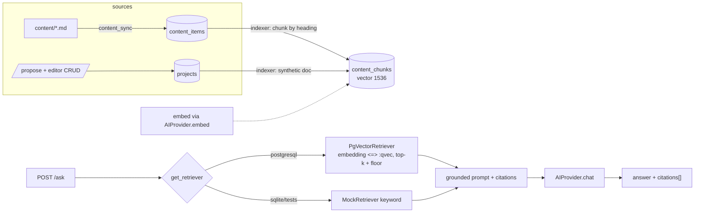

# Nimbus Revised MVP — RAG agent (pgvector) + Intake workflow + Content/Inventory surface

## Context

Nimbus is an internal AI enablement hub for Finance & Operations staff (FastAPI + Next.js 14 + Postgres, deployed on Azure Container Apps). The MVP has five pieces: a browsable content surface (guides + prompt library), a DB-native AI project inventory, a "propose an AI use case" intake workflow that feeds it, a pgvector-backed RAG agent (`/ask`) with citations, and lightweight usage metrics. Azure AI Search stays off (`enableSearch=false`); pgvector on the existing Postgres Flexible Server does retrieval.

Everything below was verified against the actual tree. Corrections to the earlier draft:

- **There is no `foundry.bicep` module.** The Foundry/AI resource is provisioned *outside* this repo; `infra/bicep/main.bicep` only passes `foundryEndpoint`/`foundryDeploymentName` params through as env vars. The embedding deployment is therefore a new **param + env var** (`AZURE_AI_FOUNDRY_EMBEDDING_DEPLOYMENT_NAME`, matching the existing `AZURE_AI_FOUNDRY_*` naming), and creating the `text-embedding-3-small` deployment on the Foundry resource is a documented manual/portal step in the runbook — not a bicep change.
- **`infra/scripts/` and `infra/bicep/deploy/` do not exist in this tree**, even though the (uncommitted) runbook edits reference them. Infra changes here touch only `infra/bicep/main.bicep`, `infra/bicep/modules/postgres.bicep`, and `docker-compose.yml`.
- **The working tree carries uncommitted user edits** (README.md, docs/runbook.md, several bicep modules — naming/doc changes). Implement on a new feature branch **on top of them**; commits that touch `docs/runbook.md` or `infra/bicep/*` will necessarily include those pre-existing edits. Do not revert them (and do not touch the Graph-introspection auth hack in `app/core/security.py`).
- Seed content already links `/g/sensitive-data` (in `content/playbooks/copilot-excel-budget-variance.md`); the UI routes below use `/guides/[slug]`, so fix that one link.

### Existing building blocks to reuse (verified)

| What | Where |
| --- | --- |
| AI provider abstraction (chat only today) | `apps/api/app/services/ai/{base,factory,mock_provider,foundry_provider}.py` |
| Route→provider dependency pattern | `ai_provider()` in `apps/api/app/api/v1/routes/chat.py` |
| Git→DB content sync (checksum-skip upsert) | `apps/api/app/services/content_sync.py`, `VALID_KINDS` in `apps/api/app/models/content_item.py` |
| Auth deps (`CurrentUser`, `require_admin`) | `apps/api/app/services/identity/current_user.py` |
| Audit trail | `apps/api/app/services/audit.py` (`record_event`), `models/audit_event.py` |
| JSON/JSONB dual-dialect column | `_JsonCol = JSON().with_variant(JSONB(), "postgresql")` in `content_item.py` |
| Typed settings | `apps/api/app/core/config.py` (`Settings`, env-file aware) |
| Web API client factory + hook | `apps/web/src/lib/api/client.ts`, `useApiClient.ts`, types in `apps/web/src/types/index.ts` (contract mirror in `packages/api-client/src/index.ts`) |
| Test fixtures (SQLite in-memory, `create_all`, dependency overrides) | `apps/api/app/tests/conftest.py` |

### Key design decisions

- **pgvector, not AI Search**: `vector(1536)` column on new `content_chunks`; cosine top-k via `embedding <=> :qvec`. The `pgvector` Python package goes in **main** dependencies (the model imports `pgvector.sqlalchemy.Vector` unconditionally; the type renders as `VECTOR(1536)` which SQLite happily accepts in `create_all`, so tests keep working — the vector *index* lives only in the migration behind a dialect guard).
- **Editor gating despite roles-free Graph tokens**: new `EDITOR_EMAILS` (comma-separated) setting; `require_editor` dependency compares the Graph-derived email case-insensitively. The dev principal (`AUTH_MODE=disabled`) is always an editor. `/me` gains `isEditor` so the UI can show/hide triage controls.
- **Prompts are a content kind**: add `"prompt"` to `VALID_KINDS`; prompt-specific fields (`audience`, `example_input`, `example_output`, `department`) live in existing `attributes` JSONB. `playbook`+`guidance` render as "Guides" in the UI — no rename migration.
- **Intake = projects with `status='proposed'`**: single `projects` table, statuses `proposed|idea|pilot|active|paused|done|rejected`; triage is a status PATCH + audit event. No workflow engine.
- **Test/SQLite compat**: retrieval goes through a `get_retriever` FastAPI dependency (mirrors `ai_provider()` in chat.py). `PgVectorRetriever` when the bound engine dialect is postgresql; `MockRetriever` (keyword scoring over `content_items`/`projects`) otherwise, so the `/ask` route is fully testable on SQLite.
- **Mock embeddings must be lexically meaningful**: `MockAIProvider.embed()` returns token-hash bag-of-words vectors (hash each token into one of 1536 buckets, count, L2-normalize) — shared vocabulary ⇒ high cosine similarity, so local RAG against docker Postgres actually retrieves the right documents offline. (A pure whole-text hash would make retrieval random.)
- **Copy/view events store `actor_email` in plain text**, consistent with `audit_events` (the draft's email-hashing adds nothing when audit already stores emails).

## Architecture of the RAG path

Phases 0→4 below are strictly ordered by dependency: 0 (pgvector + kinds) unblocks everything; 1 (content API/UI) and 2 (projects/intake) are independent of each other; 3 (RAG) needs 0 and reads tables from 1's events only tangentially; 4 aggregates over tables from 1–3.

---

## Phase 0 — Foundations: pgvector + content model extension (small)

- `docker-compose.yml`: db image `postgres:16-alpine` → `pgvector/pgvector:pg16`.
- `infra/bicep/modules/postgres.bicep`: add a `Microsoft.DBforPostgreSQL/flexibleServers/configurations` child resource setting `azure.extensions` = `'VECTOR'` (source `user-override`) so `CREATE EXTENSION vector` is allowlisted on Flexible Server.
- `infra/bicep/main.bicep`: new params `foundryEmbeddingDeploymentName` (default `text-embedding-3-small`) and `editorEmails` (default `''`); add env vars `AZURE_AI_FOUNDRY_EMBEDDING_DEPLOYMENT_NAME` and `EDITOR_EMAILS` to the api container app. Defaults keep `deploy-dev.yml` untouched.
- `apps/api/app/core/config.py`: `azure_ai_foundry_embedding_deployment_name: str = ""`, `editor_emails: str = ""` (+ an `editor_emails_list` property mirroring `cors_origins_list`).
- `apps/api/pyproject.toml`: add `pgvector>=0.3` to main dependencies.
- New migration `apps/api/app/db/migrations/versions/0003_pgvector.py`: `CREATE EXTENSION IF NOT EXISTS vector`, guarded by `op.get_bind().dialect.name == "postgresql"` (no-op on SQLite).
- Content kinds: add `"prompt"` to `VALID_KINDS` in `models/content_item.py`; document the kind + its `attributes` schema in `apps/api/content/README.md` (`content_sync.py` validates via `VALID_KINDS`, so no sync code change).
- Seed content: ~6 prompt files under `apps/api/content/prompts/` + 2 more playbooks, with realistic `attributes` (`audience`, `department`, `example_input`, `example_output`) and `related_slugs`. Fix `/g/sensitive-data` → `/guides/sensitive-data` in the budget-variance playbook.

**Verify**: `make up` → migrations apply; `docker compose exec db psql -U nimbus -c "SELECT extname FROM pg_extension"` shows `vector`; `make content-sync` ingests prompts; existing pytest suite green on SQLite.

## Phase 1 — Content read surface (guides + prompt library) (medium)

**Backend**
- New model `apps/api/app/models/content_event.py` + migration `0004_content_events.py`: `content_events(id, content_slug idx, event_type['copy'|'view'], actor_email, created_at)`. Register in `models/__init__.py`.
- New route module `apps/api/app/api/v1/routes/content.py` (register in `api/v1/router.py`), all `CurrentUser`-authenticated, following chat.py's shape:
  - `GET /content?kind=&tag=&q=` — published items only, card fields (no `body_md`); `q` = `ILIKE` on title/summary/body.
  - `GET /content/{slug}` — full item; 404 via the existing error envelope.
  - `POST /content/{slug}/events {event_type}` — insert `content_events` row.
- Schemas in new `apps/api/app/schemas/content.py` (list item, detail, event request) following `schemas/chat.py` style.

**Frontend** (`apps/web/src/app/`)
- Add `react-markdown` to `apps/web/package.json` for body rendering.
- `/guides` + `/guides/[slug]` — lists kinds `playbook|guidance|tool` with kind/tag filter chips; detail renders markdown + related-item links; fires a `view` event.
- `/prompts` + `/prompts/[slug]` — card grid (title, summary, audience chip, **Copy** button → clipboard + `copy` event); detail shows example input/output from `attributes`.
- Extend `apps/web/src/lib/api/client.ts` with `listContent/getContent/postContentEvent`, types in `src/types/index.ts` (mirror the shapes into `packages/api-client/src/index.ts` — it's the canonical contract copy).
- `components/NavBar.tsx`: add Guides / Prompts links. `app/page.tsx` becomes browse-first: featured items (the `featured` flag exists) + top links.

**Verify**: browse both sections locally; copy button writes a `content_events` row; pytest for list/detail/filter/event endpoints (seed via `db_session` fixture); vitest for the prompt card copy behavior.

## Phase 2 — Project inventory + intake workflow (medium)

**Backend**
- New model `apps/api/app/models/project.py` + migration `0005_projects.py`:
  `projects(id, name, department, owner_email, sponsor, status idx, summary, business_value, risks, dependencies, next_steps, triage_note, tools_used JSON-variant, related_slugs JSON-variant, submitted_by, last_updated_by, created_at, updated_at)` — reuse the `_JsonCol` variant pattern and `_utcnow` from `content_item.py`. Statuses validated in the Pydantic schema (StrEnum), not a DB enum.
- `require_editor` + `EditorUser` annotated dep in `services/identity/current_user.py`: authenticated user whose email (lowercased) is in `settings.editor_emails_list`, or `user.is_dev_principal`. 403 via existing `ForbiddenError`.
- `/me` (`routes/me.py`, `schemas/user.py`): add `isEditor` computed the same way (mirror into web + `packages/api-client` types).
- New route module `routes/projects.py`:
  - `GET /projects?status=&department=` and `GET /projects/{id}` — any authenticated user.
  - `POST /projects/intake` — any authenticated user; forces `status='proposed'`, sets `submitted_by` from the principal; `record_event(action="project.intake", ...)`.
  - `POST /projects` / `PATCH /projects/{id}` — `EditorUser` only; PATCH is the triage mechanism (status change; `status='rejected'` requires `triage_note`); every status transition audited (`project.status_changed`, detail `old->new`).
- Schemas in `apps/api/app/schemas/project.py` (intake payload is the narrow subset; editor create/patch is the full set).

**Frontend**
- `/projects` — table with status pills, status/department filters, "updated N days ago" staleness hint (90+ days highlighted); "Needs triage" badge on `proposed` rows when `me.isEditor`.
- `/projects/[id]` — detail; edit/triage controls rendered only for editors (backend still enforces).
- `/propose` — intake form (name, department, problem/summary, expected value, tools, risks) → success screen. Prominent link from home + NavBar ("Propose an AI use case").
- Client methods: `listProjects/getProject/submitIntake/createProject/updateProject`.

**Verify**: pytest permission matrix (plain user: intake ok / PATCH 403; editor via `EDITOR_EMAILS` monkeypatched settings: PATCH ok; rejected-without-note 422); audit rows written on intake + transitions; manual flow in `make up` (dev principal is editor).

## Phase 3 — RAG agent on pgvector (large)

**Embeddings**
- `services/ai/base.py`: add abstract `async embed(self, texts: list[str]) -> list[list[float]]`.
- `foundry_provider.py`: implement via `client.embeddings.create(model=settings.azure_ai_foundry_embedding_deployment_name, input=texts)` (reuses `_get_client()`; raise `UpstreamServiceError` if the deployment name is unset).
- `mock_provider.py`: token-hash bag-of-words vectors, 1536 dims, L2-normalized, deterministic.

**Chunks + indexer**
- New model `apps/api/app/models/content_chunk.py` + migration `0006_content_chunks.py`: `content_chunks(id, source_type['content'|'project'], source_key, chunk_index, heading, text, embedding Vector(1536), checksum, updated_at)`, unique on `(source_type, source_key, chunk_index)`. HNSW index (`vector_cosine_ops`) created only inside the postgresql dialect guard; table itself created on both dialects so `create_all` in conftest keeps working.
- New `apps/api/app/services/rag/indexer.py`:
  - Chunk `body_md` by markdown headings (target ~500–800 tokens, split oversized sections), prefixing each chunk with `title / kind / tags` context.
  - Serialize each project row to one synthetic document (name, status, department, owner, summary, value, next steps).
  - Incremental by checksum: reuse the sha256-skip approach from `content_sync.py` (per source: if checksum unchanged, skip; else delete+reinsert that source's chunks).
  - `reindex_all(db, provider)` called from `lifespan` in `app/main.py` right after `sync_content` (same best-effort try/except, skipped when `environment == "test"` or dialect isn't postgresql); projects re-indexed inline from the create/PATCH routes (volumes are tiny). New `make reindex` target running `python -m app.services.rag.indexer`.

**Retrieval + answer**
- New `apps/api/app/services/rag/retriever.py`: `Retriever` protocol; `PgVectorRetriever.search(db, query, k=6)` → `provider.embed([query])`, `ORDER BY embedding <=> :qvec` with a similarity floor (~0.15 cosine similarity for real embeddings; lower for mock), returns chunks + source metadata; `MockRetriever` scores `content_items`/`projects` by keyword overlap (SQLite-safe). `get_retriever(settings, db)` dependency picks by bind dialect.
- New route `routes/ask.py` (register in router): `POST /ask {question}` →
  1. retrieve; if nothing above floor → `{answer: fallback text, citations: []}` **without** calling the LLM;
  2. else build grounded prompt ("answer only from the context; cite sources; if not covered, say so"), call `provider.chat(...)`;
  3. `record_event(action="ask.completed", ...)`; return `{answer, citations: [{title, ref, type}]}` where `ref` is a slug or project id. Schema in `schemas/ask.py`.
- Existing `/chat` untouched.

**Frontend**
- `/ask` page modeled on `chat/page.tsx`; assistant turns render citation chips linking to `/guides/[slug]`, `/prompts/[slug]`, `/projects/[id]`. NavBar: "Ask". Home gets an "Ask the assistant" affordance. Client method `ask(question)`.

**Verify**: pytest — chunker unit tests, indexer idempotency (unchanged checksum ⇒ no re-embed), `/ask` via MockRetriever incl. empty-retrieval fallback and citation shape. Local e2e with docker Postgres + mock provider: "how do I analyze budget variance with Copilot?" must cite `copilot-excel-budget-variance` (token-hash embeddings make this deterministic). Azure smoke test post-deploy with real embeddings.

## Phase 4 — Metrics, insights, launch polish (small)

- New route `routes/insights.py`: `GET /insights/summary` (any authenticated user) — SQL aggregates only: published guides/prompts counts, projects by status, intakes last 30d (audit `project.intake`), copies last 30d + top-5 copied slugs (`content_events`), asks last 30d (audit `ask.completed`). No new tables.
- `/insights` page: stat tiles + two lists. **Load the `dataviz` skill before writing any chart/tile markup.**
- Docs: `README.md` (new surface map), `docs/architecture.md` (RAG flow, module map), `apps/api/content/README.md` (prompt kind), `docs/runbook.md` (create the embedding deployment on the Foundry resource, `EDITOR_EMAILS`, `make reindex`, pgvector allowlisting note).
- Playwright e2e (`apps/web/e2e/`): browse → copy prompt → submit intake → ask a question (mock stack).

## File/migration summary

| Area | New/changed |
| --- | --- |
| Migrations | `0003_pgvector`, `0004_content_events`, `0005_projects`, `0006_content_chunks` (chain `down_revision` in that order) |
| API routes | new `content.py`, `projects.py`, `ask.py`, `insights.py`; register all in `api/v1/router.py` |
| Services | new `rag/indexer.py`, `rag/retriever.py`; `ai/base|mock|foundry` embed support; `identity/current_user.py` (`require_editor`) |
| Models | new `project.py`, `content_chunk.py`, `content_event.py`; `content_item.py` (`VALID_KINDS` + prompt); `models/__init__.py` |
| Schemas | new `content.py`, `project.py`, `ask.py`, `insights.py`; `user.py` (`isEditor`) |
| Web | new pages `/guides[/slug]`, `/prompts[/slug]`, `/projects[/id]`, `/propose`, `/ask`, `/insights`; `NavBar.tsx`, `page.tsx`, `lib/api/client.ts`, `types/index.ts`, `globals.css`; `react-markdown` dep; mirror types in `packages/api-client` |
| Infra/config | `docker-compose.yml` (pgvector image), `postgres.bicep` (azure.extensions), `main.bicep` (2 params + env vars), `config.py` (`EDITOR_EMAILS`, embedding deployment), `pyproject.toml` (`pgvector`), `Makefile` (`reindex`) |

## Verification (end-to-end)

1. `make up` → migrations apply (extension created), content sync + reindex run at startup without errors.
2. Browse guides/prompts; copy a prompt → `content_events` row.
3. Submit `/propose` as the dev principal; triage via PATCH → status + audit rows; non-editor 403 covered by tests (dev principal is always editor locally, so the 403 path is test-only).
4. `/ask` (mock provider, real pgvector): budget-variance question cites the right playbook; nonsense question returns the no-match fallback with no LLM call.
5. `make test` (pytest on SQLite + vitest), `make lint`/`typecheck`, `make e2e` happy path; CI (`ci.yml`) runs the same gates.
6. Azure: redeploy via `main.bicep` (new params default sensibly), create the `text-embedding-3-small` deployment on the Foundry resource, set `EDITOR_EMAILS`, run migrations, smoke-test `/ask` per updated runbook.