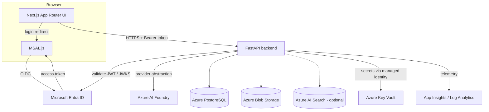

# Architecture

Nimbus is a two-tier web application: a Next.js
frontend and a FastAPI backend, with Microsoft Entra ID for identity and Azure
services for AI, data, and storage. Everything privileged happens on the backend.

## Component diagram

## Request flow (chat)

1. The user signs in via MSAL; Entra returns an access token scoped to the API.
2. The frontend calls `POST /api/v1/chat` with the token in the `Authorization`
   header (added by the typed API client).
3. The backend validates the token (issuer, audience, signature via JWKS) and
   resolves a `Principal` with roles/groups.
4. The chat route calls the `AIProvider` abstraction. In production this is the
   Azure AI Foundry provider; locally/in tests it is the mock provider.
5. The backend records an audit event and returns `{ "response": "..." }`.

## What belongs where

| Concern | Frontend | Backend |
| --- | --- | --- |
| Rendering, UX, client state | ✅ | |
| Sign-in / token acquisition (MSAL) | ✅ | |
| Attaching tokens to requests | ✅ | |
| **Token validation** | | ✅ |
| **Authorization decisions** | UX hints only | ✅ enforced |
| **AI / Foundry calls** | ❌ never | ✅ |
| Database, storage, search | ❌ | ✅ |
| Secrets / credentials | ❌ | ✅ (Key Vault + MI) |
| Business logic | thin | ✅ |

The frontend may *hint* at authorization (e.g. hide an admin link), but the
backend is the only enforcement point. See
[`adr/0002-backend-only-ai-access.md`](adr/0002-backend-only-ai-access.md).

## Backend module map

- `core/` — config, structured logging, JWT security, error envelope, middleware.
- `api/v1/` — router + routes (`health`, `me`, `chat`, `admin`).
- `services/ai/` — `AIProvider` abstraction, mock + Foundry providers, factory.
- `services/storage`, `services/search`, `services/identity`, `services/audit`.
- `db/` — SQLAlchemy engine/session, declarative base, Alembic migrations.
- `models/`, `schemas/` — persistence models vs. API request/response models.

## Configuration & environments

All backend config is centralized in `core/config.py` (typed Pydantic settings).
Two switches make the app run anywhere:

- `AI_PROVIDER` — `mock` (local/tests) or `foundry` (deployed).
- `AUTH_MODE` — `disabled` (local only) or `entra`.

## Observability

Structured JSON logs carry a per-request `correlationId` (also returned in the
`X-Correlation-ID` response header). When an App Insights connection string is
present, Azure Monitor OpenTelemetry is enabled at startup.
